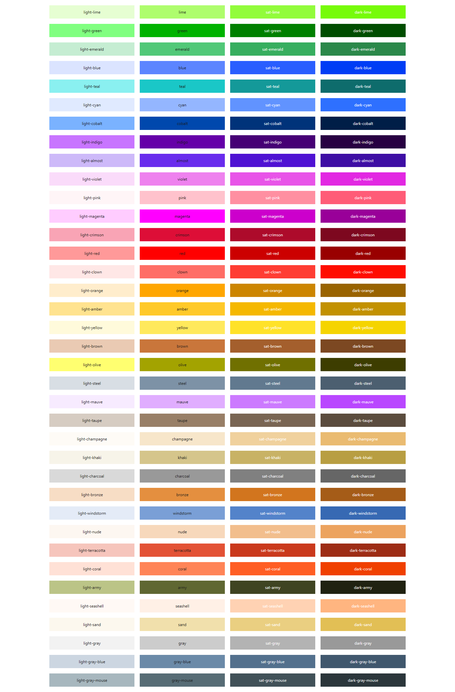

A comprehensive color utility system for Metro UI that provides CSS classes and variables for styling backgrounds, text, borders, and other visual elements with consistent color schemes.

<details>
    <summary>Click to open Color Palette</summary>

    

</details>

## Usage

### Basic Usage

The colors-css module is automatically included when you import Metro UI. You can use color classes directly in your HTML:

```html
<!-- Background colors -->
<div class="bg-blue">Blue background</div>
<div class="bg-light-green">Light green background</div>

<!-- Text colors -->
<p class="fg-red">Red text</p>
<p class="fg-dark-violet">Dark violet text</p>

<!-- Border colors -->
<div class="bd-orange">Orange border</div>

<!-- Opacity backgrounds -->
<div class="op-cyan">Semi-transparent cyan background</div>

<!-- Accent colors for components -->
<button class="button primary">Primary button</button>
<input class="input green" type="text" placeholder="Green accent input">
```

### Color Variants

Each color comes in multiple variants:
- **Base**: `color-name` (e.g., `blue`, `red`, `green`)
- **Light**: `light-color-name` (e.g., `light-blue`, `light-red`)
- **Dark**: `dark-color-name` (e.g., `dark-blue`, `dark-red`)
- **Saturated**: `sat-color-name` (e.g., `sat-blue`, `sat-red`)
- **Minor**: `minor-color-name` (e.g., `minor-blue`, `minor-red`)

### Interactive States

Most color classes support interactive states:
- **Hover**: `class-name-hover` - Applied on hover
- **Active**: `class-name-active` - Applied when active/pressed
- **Focus**: `class-name-focus` - Applied when focused

```html
<!-- Interactive background colors -->
<div class="bg-blue-hover">Hover for blue background</div>
<div class="bg-red-active">Active state with red background</div>

<!-- Interactive text colors -->
<p class="fg-green-hover">Hover for green text</p>
```

## Available Colors

The system includes the following color palette:

**Primary Colors**: lime, green, emerald, blue, teal, cyan, cobalt, indigo, violet, pink, magenta, crimson, red, orange, amber, yellow, brown, olive

**Extended Colors**: steel, mauve, taupe, champagne, khaki, charcoal, bronze, windstorm, nude, terracotta, coral, army, seashell, sand

**Neutral Colors**: dark, light, gray, gray-blue, gray-white, gray-mouse

**Special Colors**: almost, clown

## CSS Variables

### Color Variables

All colors are available as CSS variables for custom styling:

| Variable Pattern | Description | Example |
| ---------------- | ----------- | ------- |
| `--color-{name}` | Base color | `--color-blue`, `--color-red` |
| `--color-light-{name}` | Light variant | `--color-light-blue` |
| `--color-dark-{name}` | Dark variant | `--color-dark-blue` |
| `--color-sat-{name}` | Saturated variant | `--color-sat-blue` |
| `--color-minor-{name}` | Minor variant | `--color-minor-blue` |

### Special Variables

| Variable | Default | Description |
| -------- | ------- | ----------- |
| `--color-primary` | Based on theme | Primary theme color |
| `--color-secondary` | Based on theme | Secondary theme color |
| `--color-tertiary` | Based on theme | Tertiary theme color |
| `--color-success` | green | Success state color |
| `--color-alert` | #c10000 | Alert/error state color |
| `--color-warning` | orange | Warning state color |
| `--color-info` | #468cff | Information state color |
| `--color-hover-default` | rgba(25, 25, 25, 0.1) | Default hover overlay |

### Gradient Variables

| Variable | Default | Description |
| -------- | ------- | ----------- |
| `--gradient-direction` | to right | Gradient direction |
| `--gradient-position` | circle | Radial gradient position |
| `--gradient-from-color` | #000 | Gradient start color |
| `--gradient-to-color` | #5c5c5c | Gradient end color |

### Glassmorphism Variables

| Variable | Default | Description |
| -------- | ------- | ----------- |
| `--gm-value` | 16px | Blur amount for glassmorphism effect |

### Example of Custom Styling

```css
/* Using color variables */
.my-element {
    background-color: var(--color-blue);
    color: var(--color-light-blue);
    border-color: var(--color-dark-blue);
}

/* Custom gradient */
.my-gradient {
    --gradient-from-color: var(--color-blue);
    --gradient-to-color: var(--color-purple);
    --gradient-direction: 45deg;
}

/* Custom glassmorphism */
.my-glass {
    --gm-value: 20px;
}
```

## Available CSS Classes

### Background Classes

#### Base Background Classes
- `.bg-transparent` - Transparent background
- `.bg-default` - Default theme background with appropriate text color
- `.bg-hover` - Hover background effect
- `.bg-glassmorphism` - Glassmorphism effect with backdrop blur

#### Color Background Classes
- `.bg-{color}` - Solid background color
- `.bg-light-{color}` - Light variant background
- `.bg-dark-{color}` - Dark variant background
- `.bg-sat-{color}` - Saturated variant background
- `.bg-minor-{color}` - Minor variant background

#### Interactive Background Classes
- `.bg-{color}-hover` - Background color on hover
- `.bg-{color}-active` - Background color when active
- `.bg-{color}-focus` - Background color when focused

#### Social Media Backgrounds
- `.bg-facebook` - Facebook brand color
- `.bg-twitter` - Twitter brand color
- `.bg-github` - GitHub brand color
- `.bg-bootstrap` - Bootstrap brand color
- `.bg-gitlab` - GitLab brand color
- `.bg-amazon` - Amazon brand color

### Foreground/Text Classes

#### Base Text Classes
- `.fg-default` - Default theme text color

#### Color Text Classes
- `.fg-{color}` - Text color
- `.fg-light-{color}` - Light variant text color
- `.fg-dark-{color}` - Dark variant text color
- `.fg-sat-{color}` - Saturated variant text color
- `.fg-minor-{color}` - Minor variant text color

#### Interactive Text Classes
- `.fg-{color}-hover` - Text color on hover
- `.fg-{color}-active` - Text color when active
- `.fg-{color}-focus` - Text color when focused

### Border Classes

#### Base Border Classes
- `.bd-default` - Default theme border color
- `.bd-transparent` - Transparent border

#### Color Border Classes
- `.bd-{color}` - Border color
- `.bd-light-{color}` - Light variant border color
- `.bd-dark-{color}` - Dark variant border color
- `.bd-sat-{color}` - Saturated variant border color
- `.bd-minor-{color}` - Minor variant border color

#### Interactive Border Classes
- `.bd-{color}-hover` - Border color on hover
- `.bd-{color}-active` - Border color when active
- `.bd-{color}-focus` - Border color when focused

#### Pseudo-element Border Classes
- `.bd-before-{color}` - Border color for ::before pseudo-element
- `.bd-after-{color}` - Border color for ::after pseudo-element

### Opacity Classes

#### Base Opacity Classes
- `.op-default` - Default semi-transparent background (50% opacity)

#### Color Opacity Classes
- `.op-{color}` - Semi-transparent background (50% opacity)
- `.op-{color}-hi` - High transparency background (20% opacity)
- `.op-{color}-low` - Low transparency background (80% opacity)

#### Variant Opacity Classes
- `.op-light-{color}` - Light variant with opacity
- `.op-dark-{color}` - Dark variant with opacity
- `.op-sat-{color}` - Saturated variant with opacity
- `.op-minor-{color}` - Minor variant with opacity

### Gradient Classes

#### Base Gradient Classes
- `.gradient` - Applies gradient background using CSS variables
- `.gradient-text` - Applies gradient to text with background clipping

#### Color Gradient Classes
- `.gradient-{color}` - Linear gradient for specific color
- `.gradient-radial-{color}` - Radial gradient for specific color

### Accent Classes

Accent classes are designed for interactive components like buttons, inputs, and focusable elements:

#### General Accent Classes
- `.{accent-color}` - Applies accent color to background, border, and outline

#### Button Accent Classes
For buttons (`.button`, `.command-button`, `.shortcut`, `.action-button`):
- `.{accent-color}` - Solid accent button
- `.{accent-color}.outline` - Outlined accent button
- `.{accent-color}.same-color` - Maintains same color on hover/active

#### Input Accent Classes
For inputs (`.input`, `.select`, `.textarea`, etc.):
- `.{accent-color}` - Accent border and focus color

#### Focusable Accent Classes
For focusable elements (`.focusable`):
- `.{accent-color}` - Accent focus outline

### Glassmorphism Classes
- `.bg-glassmorphism` - Applies glassmorphism effect with backdrop blur

### Outline Classes
- `.ol-{color}` - Applies an outline of the specified color
- `.ol-light-{color}` - Applies an outline of the specified color with light variant
- `.ol-minor-{color}` - Applies an outline of the specified color with minor variant
- `.ol-sat-{color}` - Applies an outline of the specified color with saturated variant
- `.ol-dark-{color}` - Applies an outline of the specified color with dark variant

### Pseudo-element Classes
- `.before-bg-{color}` - Applies a background color to the `::before` pseudo-element
- `.before-fg-{color}` - Applies a text color to the `::before` pseudo-element
- `.before-bd-{color}` - Applies a border color to the `::before` pseudo-element

Variants of these classes are also available:
- `.before-{where}-light-{color}`
- `.before-{where}-minor-{color}`
- `.before-{where}-dark-{color}`
- `.before-{where}-sat-{color}`

### Ribbed Classes
- `.ribbed-{color}` - Applies a ribbed background effect with the specified color
- `.ribbed-light-{color}` - Applies a ribbed background effect with the light variant of the specified color
- `.ribbed-minor-{color}` - Applies a ribbed background effect with the minor variant of the specified color
- `.ribbed-dark-{color}` - Applies a ribbed background effect with the dark variant of the specified color
- `.ribbed-sat-{color}` - Applies a ribbed background effect with the saturated variant of the specified color

### Stroke Classes
- `.stroke-{color}` - Applies a stroke effect with the specified color
- `.stroke-light-{color}` - Applies a stroke effect with the light variant of the specified color
- `.stroke-minor-{color}` - Applies a stroke effect with the minor variant of the specified color
- `.stroke-sat-{color}` - Applies a stroke effect with the saturated variant of the specified color
- `.stroke-dark-{color}` - Applies a stroke effect with the dark variant of the specified color

### SVG Classes
- `.fc-{color}` - Applies a fill color to SVG elements
- `.sc-{color}` - Applies a stroke color to SVG elements

Variants of these classes are also available:
- `.fc-light-{color}` - Light variant fill color
- `.fc-minor-{color}` - Minor variant fill color
- `.fc-dark-{color}` - Dark variant fill color
- `.fc-sat-{color}` - Saturated variant fill color
- `.sc-light-{color}` - Light variant stroke color
- `.sc-minor-{color}` - Minor variant stroke color
- `.sc-dark-{color}` - Dark variant stroke color
- `.sc-sat-{color}` - Saturated variant stroke color


## Dark Mode Support

The colors-css module automatically supports dark mode through the `.dark-side` class. When applied to a parent element, color variables are automatically adjusted for dark themes:

```html
<!-- Light mode -->
<div class="bg-blue fg-white">Light mode content</div>

<!-- Dark mode -->
<div class="dark-side">
    <div class="bg-blue fg-white">Dark mode content</div>
</div>
```

In dark mode:
- `--gradient-from-color` changes from `#000` to `#fff`
- `--gradient-to-color` changes from `#5c5c5c` to `#cacaca`
- All color variables automatically adapt to dark theme variants

## Best Practices

- **Use semantic color names**: Prefer `bg-primary` or `bg-success` over specific color names when possible
- **Combine with variants**: Use light/dark variants to create visual hierarchy
- **Leverage interactive states**: Use hover/active/focus variants for better user experience
- **Consider accessibility**: Ensure sufficient contrast between background and text colors
- **Use CSS variables**: For custom components, use the provided CSS variables instead of hardcoded colors
- **Test in both themes**: Always verify your color choices work in both light and dark modes

## Additional Notes

- All color classes use `!important` to ensure they override other styles
- The system uses HSL color space for opacity calculations, providing better color consistency
- Gradient classes work with CSS custom properties, allowing dynamic gradient customization
- Social media brand colors include appropriate contrasting text colors
- The glassmorphism effect requires a backdrop-filter compatible browser
- Yellow and light accent colors automatically use dark text for better readability